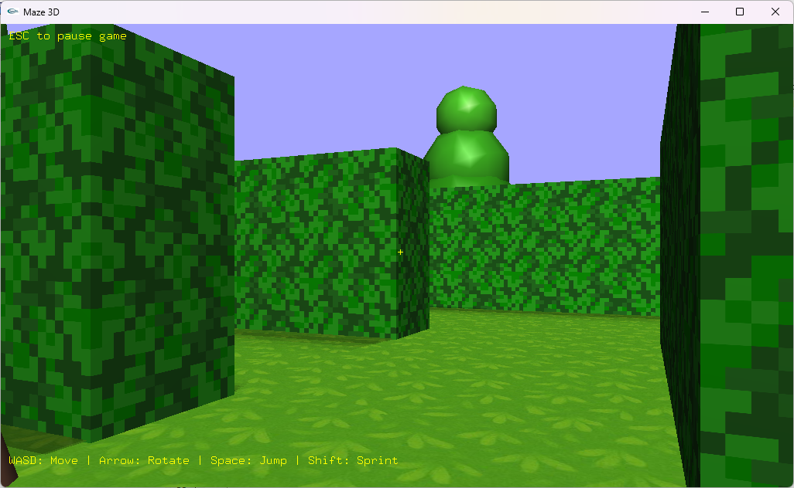

# Maze3D Game

## Meet the Team

- Ruth Septriana Sipangkar   (24060124120024)
- Sarifa Nuha Ardanti Jusmar (24060124130082)
- Syafira Azka Ramadhani     (24060124130088)
- Yasmina Syahidah           (24060124130116)

Informatika 2024 Kelas C

## About the game

Maze3D adalah permainan puzzle-adventure tiga dimensi yang dikembangkan menggunakan OpenGL dan GLUT pada lingkungan Dev-C++. Game ini menggunakan sudut pandang orang pertama (*First-Person Point of View*), sehingga pemain dapat menjelajahi labirin secara langsung dari perspektif karakter.

Tujuan utama permainan adalah menemukan jalan keluar dari labirin sambil menghindari berbagai rintangan yang tersebar di area permainan, seperti pohon, lubang, dan duri. Pemain harus menavigasi labirin dengan cermat untuk mencapai titik akhir dan menyelesaikan permainan.

    
    
Game Preview

Mekanik permainan:
- ASWD untuk gerak badan
- Arrow untuk arah pandang
- Space untuk lompat
- Shift untuk sprint

Proyek ini dibuat sebagai bagian dari tugas mata kuliah Grafika Komputer dan menampilkan implementasi objek 3D, tekstur, pencahayaan, animasi, serta deteksi tabrakan (collision detection) menggunakan OpenGL.

## Tech Used

`Glut`, `devCPP`